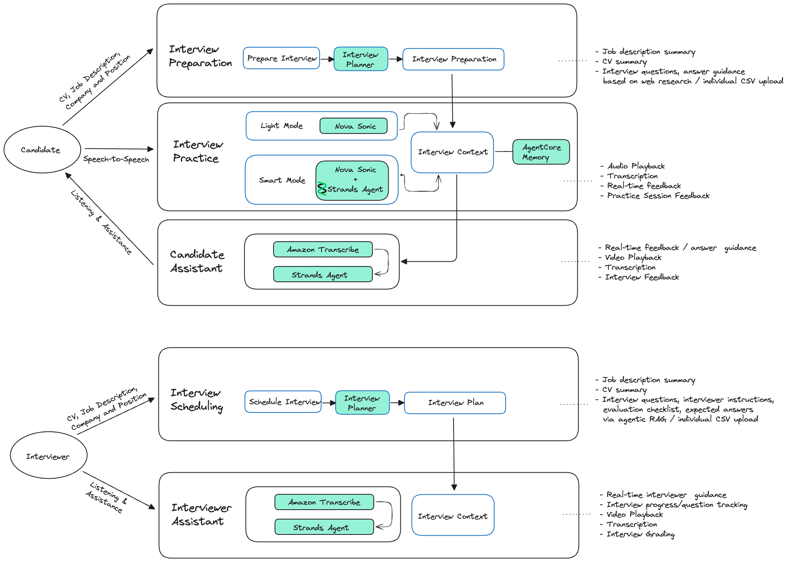
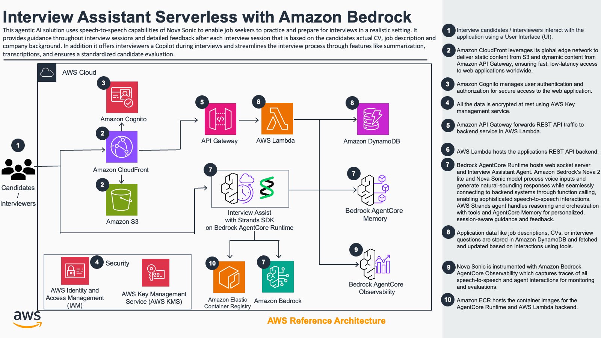

# interview-assistant

## Table of Contents

1. [Overview](#overview)
   - [What It Does](#what-it-does)
   - [Key Benefits](#key-benefits)
   - [Features](#features)
2. [Interview Question Management](#interview-question-management)
3. [Architecture Overview](#architecture-overview)
   - [Frontend Features](#frontend-features)
   - [Backend Architecture](#backend-architecture)
   - [Repository Structure](#repository-structure)
   - [Cost](#cost)
4. [Prerequisites](#prerequisites)
   - [Operating System](#operating-system)
   - [System Requirements](#system-requirements)
   - [Supported Regions](#supported-regions)
5. [Deployment Steps](#deployment-steps)
6. [Deployment Validation](#deployment-validation)
7. [Additional Documentation](#additional-documentation)
8. [Cleanup](#cleanup)
9. [Disclaimer](#disclaimer)
10. [License](#license)
11. [Security](#security)
12. [Authors](#authors)


## Overview

An AI-powered interview assistant leveraging Amazon Bedrock Nova Sonic and AWS Strands SDK to standardize interview processes, reduce hiring bias, and improve candidate preparation through natural speech-to-speech interactions.

### What It Does

**Dual-Persona Support:**

- **Candidates:** Practice interviews with AI, receive personalized coaching, and get real-time guidance during actual interviews
- **Interviewers:** Standardized interview planning, real-time copilot assistance, and objective candidate evaluation

**Powered By:**

- Amazon Nova Sonic for natural speech-to-speech conversations
- AWS Strands SDK for agentic AI orchestration
- Amazon Bedrock Knowledge Base for intelligent question retrieval
- Real-time grounding and understanding via Nova models

### Key Benefits

**For Hiring Organizations:**

- Reduce time-to-hire through standardized, efficient processes
- Lower cost-per-hire via automation and consistency
- Measurable bias reduction through objective evaluation
- Standardized assessment eliminating interviewer variability

**Technical Innovation:**

- Natural conversation flow without anxiety-inducing text interfaces
- Automated interview plan generation and analysis via agentic workflows
- Real-time feedback and performance tracking
- Documented metrics enabling objective candidate comparison

### Features

**Candidate Tools:**

- Speech-to-speech practice sessions grounded in CV, job description, and company context
- Personalized interview plans with AI-generated questions that are grounded in web-researched company and job details
- Real-time feedback on communication style, response quality, and technical accuracy
- Performance tracking dashboard showing improvement metrics over time
- Live interview copilot providing real-time suggestions and guidance
- Post-interview summaries, recordings, transcripts, and actionable feedback

**Interviewer Tools:**

- Standardized interview planning with customizable assessment frameworks
- AI-generated questions via agentic RAG or or manual CSV upload
- Customizable question bank with evaluation criteria and expected answers
- Real-time interview copilot tracking progress and suggesting next questions
- Automated candidate evaluation with structured feedback generation
- Complete interview recording with transcript and playback

**Technical Capabilities:**

- 55+ RESTful API endpoints supporting comprehensive functionality
- Scalable serverless architecture handling 1,000+ users
- Low-latency speech processing
- Real-time feedback generation via Amazon Bedrock
- Mobile-responsive frontend with WebSocket support for real-time features
- AI-powered question selection using Amazon Bedrock Knowledge Base with S3 Vectors
- Full-resolution video recording with S3 multipart upload streaming



For candidates:

1/ Interview Practice: Speech-to-Speech Agent creates a realistic practice and personalized environment and provides actionable feedback throughout and after practice sessions. The Interview Practice Assistant - Duo Lingo for interviews - with speech-to-speech takes a CV, job description, and company details, and then creates practice sessions with questions and feedback.

2/ Interview Copilot: Agent listens in an actual interview and provides guidance to candidate based on interviewer questions and candidate answers and provides detailed feedback after each interview session.

For interviewers / hiring managers:

1/ Assisted interview scheduling with detailed interview plan generation.
2/ Interview Copilot: Agent listens in an actual interview and provides guidance to interviewer based on questions/answers, and interview progression.
3/ Standardized interview grading

## Interview Question Management

The application supports **three modes** for generating interview questions:

### 1. Agentic RAG for Interviewers

Automatically selects relevant questions using Amazon Bedrock Knowledge Base with semantic vector search.

**How it works:**

- Interviewers upload candidate resume and job description
- System summarizes key skills and job requirements
- Bedrock Knowledge Base retrieves curated interview questions via semantic search
- AI agent selects 5-6 most relevant questions with structured output
- Questions include: interviewer instructions, evaluation criteria, expected answer, difficulty, time alloaction, and relevance reasoning

**Key Features:**

- Semantic matching based on resume skills, JD requirements, and interview type
- Metadata filtering by category (Technical Skills, Behavioral, System Design, ...)
- Curated question bank with markdown formatting
- Automatically expands as new questions are added to the Knowledge Base

**Knowledge Base Structure:**

- **Storage:** Markdown files in `lib/stacks/backend/knowledge-base-data/`
- **Format:** Structured sections (Instructions, Evaluation Criteria, Expected Answer)
- **Metadata:** Category and difficulty tags for filtering
- **Vector Store:** S3 Vectors with Titan Embeddings (cost-optimized, fully managed)

### 2. Web Research for Candidate Interview Prep

Automatically selects practice questions using Amazon Nova Grounding / web research of company culture and interview patterns to help prepare candidates effectively.

**How it works:**

- Candidates provide resume, job description, company name, and job title
- System summarizes key skills and requirements
- AI agent performs web search to gather company information
- Research findings include: company culture, values, and interview process insights from sources such as Glassdoor, Blind, Reddit
- Questions are generated based on research findings, job description, and candidate profile

**Web Search Options:**

- **DuckDuckGo Search** (optional): Returns up to 2 search results per query
- **Amazon Nova Grounding** (default): Uses Amazon Bedrock's native web grounding with Nova Lite for real-time information retrieval
  - Enable via feature flag: `USE_NOVA_GROUNDING=true`

**Research Categories:**

1. **Company Information** - Basic company details and industry
2. **Company Culture & Values** - Work environment, values, and employee insights
3. **Interview Process Insights** - Interview patterns, question types, and candidate experiences

**Key Features:**

- Grounded research - Only includes information found through web search (no invented data)
- Multiple search queries per candidate (company culture, interview process, recent news)
- Results integrated into interview preparation plan

**Privacy & Safety:**

- All research is based on publicly available information
- No personal data is stored or shared
- Research findings are specific to each preparation session

### 3. Manual CSV Upload

Candidates & Interviewers can also upload interview questions in CSV format to control interview content and structure entirely.

**CSV Format (7 columns):**

1. **question** (required) - The interview question text
2. **category** (optional, defaults to 'General') - Question category (Behavioral, Technical Skills, System Design, etc.)
3. **difficulty** (optional, defaults to 'medium') - Difficulty level: easy, medium, hard
4. **time** (optional) - Time allocation for the question (e.g., "5 minutes", "10-12 minutes")
5. **instructions** (optional) - Interviewer guidance on conducting the question
6. **evaluation** (optional) - Evaluation checklist items (one per line)
7. **answer** (optional) - Expected answer or key points to look for

**Note:** The "reasoning" field is automatically generated by AI in AI-powered modes and is not part of CSV uploads.

**Key Features:**

- Markdown format support (line-breaks, code blocks for technical questions etc)
- Collapsible sections in the UI (instructions, evaluation, answers)
- CSV template with example questions available for download in the application

## Architecture Overview

This project deploys an interview assistant application on AWS using CDK. The application consists of:

1. **REST API Backend**: AWS Lambda function (FastAPI with Mangum adapter) behind API Gateway
2. **Speech-to-Speech Backend**: Amazon Bedrock AgentCore Runtime for bidirectional audio streaming
3. **Web Frontend**: React application hosted in Amazon S3 and accessed via Amazon CloudFront

The application is deployed on AWS using the following **serverless** services:

- **AWS Lambda**: Serverless compute for REST API endpoints (FastAPI application) and deployment automation
- **Amazon API Gateway**: HTTP API for routing REST requests to Lambda with JWT authorization
- **Amazon Bedrock AgentCore Runtime**: Managed service for bidirectional speech-to-speech streaming with Nova Sonic
- **Amazon Bedrock AgentCore Memory**: For learning user communication styles and preferences
- **Amazon ECR**: For storing Docker container images (Lambda and AgentCore containers)
- **Amazon Cognito**: User Pool, Identity Pool, and User Pool Groups for authentication
- **Amazon DynamoDB**: For session data storage (SESSION-PREP and SESSION-HISTORY tables with GSIs)
- **Amazon S3**: Website bucket, data bucket, logging bucket, and S3 Vectors bucket for Knowledge Base
- **Amazon CloudFront**: CDN for frontend hosting with API Gateway origin routing
- **AWS WAF**: Two WebACLs - CloudFront WAF (IP reputation, bot control) and Regional WAF (rate limiting, managed rules for Cognito)
- **Amazon Bedrock**: Nova Sonic (S2S), Nova/Claude models (text generation), Titan embeddings
- **Amazon Bedrock Knowledge Base**: AI-powered question selection with S3 Vectors storage
- **Amazon Transcribe**: Real-time speech-to-text for live assistant
- **AWS CodeBuild**: Frontend React application build and deployment
- **AWS Step Functions**: State machine for deployment orchestration (custom resources)
- **AWS Systems Manager Parameter Store**: Runtime configuration sharing between stacks
- **Amazon CloudWatch Logs**: Log retention and monitoring for all Lambda functions

**Architecture Benefits:**

- ✅ **Zero Infrastructure Management**: No cluster, nodes, or Kubernetes
- ✅ **Automatic Scaling**: Lambda and AgentCore scale automatically based on demand
- ✅ **Pay-per-Use**: Only pay for actual request duration and model inference
- ✅ **Built-in High Availability**: Multi-AZ by default
- ✅ **Simplified Deployments**: Single `cdk deploy` command updates all functions
- ✅ **Native WebSocket Support**: AgentCore handles all bidirectional streaming complexity
- ✅ **Cost-Optimized Vector Storage**: S3 Vectors (50-70% cheaper than OpenSearch Serverless)
- ✅ **Defense in Depth**: WAF protection at both CloudFront (edge) and Cognito (regional) layers



### Frontend Features

The frontend React application provides two main user views:

#### Candidate View

- **Dashboard**: Overview of practice sessions and interview preparations
- **Prepare Interview**: Create and manage interview preparation plans with CV and job description uploads
- **Live Practice**: Real-time speech-to-speech interview practice sessions using Amazon Nova Sonic
- **Live Assistant**: AI assistant with screen share capture and video recording for interview guidance and tips
- **Interview Sessions**: Review past interviews with detailed feedback, analytics, and video playback

#### Interviewer View

- **Schedule Interview**: Create and manage interview schedules with AI-powered or CSV-based question generation
- **Live Assistant**: Real-time AI assistant with screen share capture and video recording during interviews
- **Interview Sessions**: View and manage conducted interview sessions with candidate analytics and video playback

**Key Technologies:**

- React with React Router for navigation
- CloudScape Design System for consistent AWS-style UI components
- AWS Amplify for Cognito authentication (Midway federation)
- Native WebSocket for real-time speech-to-speech communication
- Socket.io for general real-time updates
- Audio processing utilities for microphone input and audio playback
- Video capture utilities for screen share recording and frame extraction (pull-based architecture)
- Axios for REST API communication

### Backend Architecture

The Python backend consists of **two separate serverless deployments**:

#### 1. AWS Lambda REST API (API Gateway + Lambda Container)

**Single Lambda function** serving **55 REST API endpoints** via FastAPI with Mangum adapter:

**API Endpoints:**

- **Interview Planning**: Generate and manage interview preparation plans
- **Practice Sessions**: Create, manage, and retrieve practice sessions
- **File Processing**: Upload CVs, job descriptions, and parse web content
- **Analytics**: Session history, feedback, and performance metrics
- **User Management**: Authentication, user data, and settings
- **Q&A Bank**: Categorized question and answer management

**Core Services:**

- `candidate_planner_service.py` - Creates interview prep plans for candidates (resume/JD summary, web research, question generation)
- `interviewer_planner_service.py` - Creates structured interview plans for interviewers (supports both KB and CSV modes)
  - AI Mode: Resume/JD summarization → KB query (semantic search with S3 Vectors) → AI selection (5-6 questions)
  - CSV Mode: Parse uploaded CSV → Validate format → Structure questions with full metadata
- `interview_analysis_service.py` - Analyzes interview performance and provides feedback
- `database_service.py` - DynamoDB operations for session data (including video metadata)
- `memory_service.py` - AgentCore Memory integration
- `knowledgebase_service.py` - Bedrock Knowledge Base integration with S3 Vectors for question retrieval

**Deployment:**

- **Docker Container**: FastAPI application packaged as Lambda container image
- **API Gateway**: HTTP API with JWT authorizer (Cognito User Pool)
- **Runtime**: Python 3.12 on ARM64 (Graviton2)
- **Memory**: 1024MB, Timeout: 900 seconds (15 minutes)
- **Networking**: No VPC required (direct internet access)

#### 2. Amazon Bedrock AgentCore Runtime (WebSocket S2S)

**Managed bidirectional speech-to-speech streaming** via WebSocket endpoint at `/ws`:

**Key Components:**

- `interview_agent.py` - AgentCore Runtime entry point with `@app.websocket` handler
- `s2s_session_manager.py` - Nova Sonic bidirectional streaming manager with async queues
- `s2s_events.py` - WebSocket event handlers and message protocol
- `session_transition_manager.py` - Session lifecycle and state transitions
- `live_assistant_service.py` - Real-time AI assistant using Amazon Transcribe

**WebSocket Message Protocol:**

- `session_init` - Initialize interview session (prep_id, voice_id, mode)
- `audio_chunk` - Bidirectional audio data streaming (base64 encoded)
- `requestFrame` - Server-initiated frame capture request (pull-based, 0.2 FPS)
- `frameReady` - Client frame upload confirmation (~300 bytes)
- `session_end` - Client-initiated session termination

**Video Recording Capabilities:**

- **Pull-Based Frame Capture (PATH A):** Agent-controlled on-demand frame requests
  - Frame rate: 0.2 FPS (5 seconds per frame) - configurable
  - Resolution: Full HD 1920×1080 maintained
  - Bandwidth: 95% reduction vs. push-based (10.8KB vs 339KB per 30s)
  - Delivery: Direct S3 upload with presigned URLs, WebSocket confirmations only
- **Full-Resolution Recording (PATH B):** MediaRecorder API with streaming to S3
  - Format: WebM/VP9+Opus with VBR compression
  - Quality: 2.5 Mbps video, 128 kbps audio
  - Upload: S3 multipart upload with 30-second chunks
  - Buffering: Client-side 5MB minimum chunk safety mechanism
  - Storage: ~177MB per 30-minute session with lifecycle policies

**Deployment:**

- **Docker Container**: BedrockAgentCoreApp framework on port 8080
- **Runtime**: Python 3.12-slim with OpenTelemetry instrumentation
- **Model**: Amazon Nova Sonic v2 for speech-to-speech
- **Features**: Built-in session management, automatic scaling, native WebSocket support
- **Health Check**: Auto-managed `/ping` endpoint

**Backend Integration:**
The AgentCore Runtime uses direct DynamoDB access and local tool definitions for:

- Managing interview questions and session state
- Tracking question progression and candidate responses
- Coordinating session lifecycle and transitions
- Generating presigned URLs for video frame uploads via REST API

#### Key Components

- **Authentication** (`auth.py`) - JWT token validation with AWS Cognito
- **API Routes** (`restapi.py`) - 55+ FastAPI endpoints with error handling and retry logic
- **Session Memory** (`interview_session_memory.py`) - Conversation history and context management
- **AI Agents** (`live_assistant_agent.py`) - Strands AI agent framework integration
- **Tools** (`tools/web_search.py`) - LLM tools for web search capability
- **Feature Flags** (`config/feature_flags.py`) - Runtime configuration management

#### Data Models

- `interview_planner_models.py` - Interview plan structure and validation
- `interview_analysis_models.py` - Session analysis and feedback models
- `live_practice_models.py` - Practice session data structures

#### AI Prompt Engineering

Dedicated prompt modules for each service:

- `candidate_planner_prompts.py` - Resume/JD summarization and question generation
- `interviewer_planner_prompts.py` - Interview flow and structure planning
- `interview_planner_prompts.py` - Interview question generation
- `live_practice_prompts.py` - Real-time interview conversation
- `interviewer_session_prompts.py` - Live interviewer assistance

#### Key Technologies

- **FastAPI** - Modern async web framework
- **AWS Bedrock** - Amazon Nova Sonic for speech-to-speech, Claude for text generation
- **AWS Transcribe** - Real-time speech-to-text for live assistant
- **Strands Agents** - AI agent framework for tool use and orchestration
- **WebSockets** - Native WebSocket for low-latency audio streaming
- **DynamoDB** - NoSQL database for session data, user feedback, and file metadata
- **S3** - Object storage for uploaded files and audio recordings
- **OpenTelemetry** - Distributed tracing and observability
- **Boto3** - AWS SDK with retry logic and exponential backoff

### Repository Structure

```
  interview-assistant/
  ├── bin/
  │   └── app.ts              # CDK app entrypoint
  ├── lib/
  │   ├── stage.ts            # Application stage definition
  │   └── stacks/
  │       ├── pipeline.ts     # CI/CD pipeline stack
  │       ├── frontend/       # Frontend stack and React app
  │       │   ├── index.ts    # Frontend CDK stack (S3, CloudFront, WAF)
  │       │   ├── package.json # Frontend dependencies (React, CloudScape)
  │       │   ├── public/     # Static assets (images, HTML)
  │       │   └── src/        # React application source
  │       │       ├── pages/  # React pages (22+ components)
  │       │       │   ├── Dashboard.jsx
  │       │       │   ├── PrepareInterviewNew.jsx
  │       │       │   ├── LivePracticeSession.jsx
  │       │       │   ├── InterviewerNew.jsx
  │       │       │   └── ... (and more)
  │       │       ├── services/
  │       │       │   ├── api.js           # REST API service (API Gateway)
  │       │       │   └── s2sWebSocket.js  # WebSocket for AgentCore Runtime
  │       │       ├── utils/
  │       │       │   └── audioUtils.js    # Audio processing utilities
  │       │       ├── config/
  │       │       │   └── amplify-config.js # AWS Amplify configuration
  │       │       ├── App.js               # Main app component with routing
  │       │       └── index.js             # App entry point
  │       └── backend/        # Backend serverless stacks
  │           ├── index.ts    # Main backend CDK stack
  │           │
  │           ├── lambda-rest-api/   # Lambda REST API
  │           │   ├── index.ts       # Lambda + API Gateway CDK stack
  │           │   └── app/           # FastAPI application (25 files)
  │           │       ├── main.py    # FastAPI entry point with Mangum
  │           │       ├── candidate_api.py    # Candidate endpoints
  │           │       ├── interviewer_api.py  # Interviewer endpoints
  │           │       ├── analytics_api.py    # Analytics endpoints
  │           │       │
  │           │       ├── candidate_planner_service.py
  │           │       ├── candidate_planner_prompts.py
  │           │       ├── interviewer_planner_service.py
  │           │       ├── interviewer_planner_prompts.py
  │           │       ├── interview_planner_service.py
  │           │       ├── interview_analysis_service.py
  │           │       │
  │           │       ├── services/
  │           │       │   ├── database_service.py
  │           │       │   ├── memory_service.py
  │           │       │   └── knowledgebase_service.py
  │           │       ├── config/
  │           │       │   └── feature_flags.py
  │           │       ├── requirements.txt    # REST API dependencies
  │           │       ├── Dockerfile          # Lambda container
  │           │       └── README.MD           # REST API documentation
  │           │
  │           ├── knowledge-base-data/    # Knowledge Base questions
  │           │   ├── question_001.md          # Question in markdown format
  │           │   ├── question_001.md.metadata.json  # Question metadata
  │           │   ├── question_002.md          # Additional questions
  │           │   ├── question_002.md.metadata.json
  │           │   └── ...                      # More curated questions
  │           │
  │           ├── agentcore-runtime/   # AgentCore Runtime (S2S)
  │           │   ├── index.ts         # AgentCore Runtime CDK stack
  │           │   └── app/             # S2S/WebSocket application (21 files)
  │           │       ├── interview_agent.py  # AgentCore entry point
  │           │       ├── s2s_session_manager.py  # Nova Sonic streaming
  │           │       ├── s2s_events.py           # WebSocket events
  │           │       ├── session_transition_manager.py
  │           │       ├── live_assistant_service.py
  │           │       ├── live_assistant_agent.py
  │           │       ├── conversation_history.py
  │           │       ├── interview_session_memory.py
  │           │       │
  │           │       ├── services/
  │           │       │   ├── database_service.py
  │           │       │   └── memory_service.py
  │           │       ├── tools/
  │           │       │   └── web_search.py
  │           │       ├── config/
  │           │       │   └── feature_flags.py
  │           │       ├── requirements.txt    # S2S dependencies
  │           │       └── Dockerfile          # AgentCore container
  │           │
  │           ├── auth/       # Cognito authentication resources
  │           ├── storage/    # DynamoDB tables
  │           ├── guardrails/ # Bedrock Guardrails
  │           └── knowledgebase/  # Knowledge base resources
  │
  ├── tools/
  │   ├── cli.ts              # Custom CLI tool (npm run kit)
  │   └── export.ts           # Export utility
  ├── test/                   # Test suites
  │   ├── backend/            # Backend unit tests (pytest)
  │   └── e2e/                # End-to-end tests (Playwright)
  │       ├── candidate-flow.spec.ts    # Candidate experience E2E tests
  │       ├── interviewer-flow.spec.ts  # Interviewer experience E2E tests (to be implemented)
  │       └── helpers/        # Test helper utilities with configurable prefix scanning
  ├── test-data/              # E2E test scenarios (candidate_* and interviewer_* folders)
  ├── assets/                 # Static assets, images
  ├── package.json            # Root NPM dependencies
  ├── tsconfig.json           # TypeScript configuration
  ├── cdk.json                # CDK configuration
  └── eslint.config.ts        # ESLint configuration
```

### Cost

You are responsible for the cost of the AWS services used while running this Guidance. As of January 2025, the cost for running this Guidance with the **serverless architecture** and default settings in the AWS Region US East 1 (N. Virginia) is approximately **$85 per month** for moderate usage (100 MAU, 10K Lambda invocations, 100 AgentCore sessions).

We recommend creating a [Budget](https://docs.aws.amazon.com/cost-management/latest/userguide/budgets-managing-costs.html) through [AWS Cost Explorer](https://aws.amazon.com/aws-cost-management/aws-cost-explorer/) to help manage costs. Prices are subject to change. For full details, refer to the pricing webpage for each AWS service used in this Guidance.

### Sample Cost Table (Serverless Architecture)

The following table provides a sample cost breakdown for deploying this Guidance with the serverless architecture in the US East (N. Virginia) Region for one month.

**Assumptions:**

- 100 monthly active users (MAU)
- 10,000 Lambda invocations per month (avg 5s duration, 1024MB memory)
- 100 AgentCore Runtime sessions per month (1000 minutes total)
- 10 million Bedrock input tokens, 1 million output tokens per month
- Knowledge Base: 100 queries/month with S3 Vectors storage
- 4 S3 buckets (website, data, logging, vectors) with 1 GB total storage
- 2 DynamoDB tables with GSIs, 1 GB storage, 10K read/write units
- 100 hours Transcribe streaming for live assistant
- 2 WAF WebACLs protecting CloudFront and Cognito
- ~10 CodeBuild builds per month for frontend deployments

| AWS Service                          | Dimensions                                                                      | Cost [USD] |
| ------------------------------------ | ------------------------------------------------------------------------------- | ---------- |
| **AWS Lambda**                       | 10K invocations/month, 1024MB memory, avg 5s duration + deployment functions    | ~$5.00     |
| **Amazon API Gateway**               | HTTP API, 100K requests/month                                                   | ~$0.10     |
| **Amazon Bedrock AgentCore Runtime** | 100 sessions/month (10 min avg), 1000 minutes total                             | ~$20.00    |
| **Amazon Bedrock (Models)**          | Nova Sonic S2S (1000 min audio), Nova/Claude text (10M input, 1M output tokens) | ~$25.00    |
| **Amazon Cognito**                   | 100 MAU, Essentials security features enabled                                   | ~$13.00    |
| **Amazon DynamoDB**                  | 2 tables with GSIs, 1 GB storage, 10K read/write units                          | ~$2.00     |
| **Amazon S3**                        | 4 buckets (website, data, logging, vectors), 1 GB storage, 100K requests        | ~$0.60     |
| **Amazon CloudFront**                | 1 GB data transfer, 500K HTTPS requests                                         | ~$0.60     |
| **AWS WAF**                          | 2 WebACLs (CloudFront + Regional), 100K requests/month                          | ~$6.00     |
| **Amazon ECR**                       | 2 GB storage (Lambda + AgentCore container images)                              | ~$0.20     |
| **Amazon Transcribe**                | 100 hours real-time streaming (live assistant)                                  | ~$2.40     |
| **AgentCore Memory**                 | 1 GB storage, 10K read/write operations                                         | ~$1.00     |
| **CloudWatch Logs**                  | 1 GB log ingestion and storage                                                  | ~$1.00     |
| **AWS CodeBuild**                    | Frontend builds (~10 builds/month, small compute)                               | ~$0.50     |
| **AWS Step Functions**               | Deployment state machines (~100 transitions/month)                              | ~$0.10     |
| **SSM Parameter Store**              | 2 standard parameters                                                           | Free       |
| **Amazon Bedrock Knowledge Base**    | S3 Vectors storage, ~100 queries/month (cost-optimized)                         | ~$5.00     |
| **Total (Moderate Usage)**           | **Monthly Cost for All Services**                                               | **~$83**   |

## Prerequisites

Install [Node](https://docs.npmjs.com/downloading-and-installing-node-js-and-npm), [Python](https://www.python.org/downloads/), and the [AWS CDK CLI](https://docs.aws.amazon.com/cdk/v2/guide/getting_started.html#getting_started_install) then complete the [prerequisites for CDK deployments](https://docs.aws.amazon.com/cdk/v2/guide/deploy.html#deploy-prerequisites) if you have not previously done so.

### Operating System

This solution deploys to AWS using Amazon Linux 2. For local development and testing, you can use any operating system (Linux, Windows, or MacOS) as long as Python is installed.

### System Requirements

- Python 3.12+
- Node.js 22+
- AWS CLI configured with appropriate permissions
- Docker Desktop (optional - only needed for local development/testing)

**Python Dependencies** (see respective dependencies in `lib/stacks/backend/agentcore-runtime/app/requirements.txt` and `lib/stacks/backend/lambda-rest-api/app/requirements.txt`)

### Supported Regions

This solution must be deployed in a region in which Amazon Nova Sonic is available.

## Deployment Steps

### 1. Clone the repository:

```bash
git clone git@ssh.gitlab.aws.dev:applied-ai-and-data-architects/interview-assistant-serverless.git
cd interview-assistant
```

### 2. Choose authentication method:

The application supports OAuth authentication as well as direct authentication with AWS Cognito.
The authentication mode is set at build time via CDK and can be configured in the cdk.json file.
Currently it defaults to direct Cognito authentication as default.

```bash
"midway": false,
"enableDirectAuth": true,
```

### 3. Install Dependencies

From the root directory, run the command `npm install` to install the [CDK](https://docs.aws.amazon.com/cdk/v2/guide/work-with-cdk-typescript.html#work-with-cdk-typescript-dependencies) and React dependencies.

```bash
npm install
```

This will install:

- CDK dependencies for infrastructure deployment
- Frontend React dependencies (via npm workspaces)
- Python dependencies (via uv - automatic postinstall hook)

### 4. Deploy Serverless Backend

The deployment will:

1. **Deploy Lambda REST API**: API Gateway + Lambda function (FastAPI with Mangum)
2. **Deploy AgentCore Runtime**: Bedrock AgentCore Runtime for S2S streaming
3. **Deploy Frontend**: S3 + CloudFront + WAF
4. **Configure Authentication**: Cognito User Pool with JWT authorizer
5. **Provision Storage**: DynamoDB tables for session data


**Option A: Direct CDK Deployment**

Use [`cdk deploy`](https://docs.aws.amazon.com/cdk/v2/guide/ref-cli-cmd-deploy.html), deploy all stacks at once:

```bash
npm run cdk deploy "*/**"
```

**Option B: Interactive Deployment**

```bash
npm run kit
```

Then select the "Deploy CDK Stack(s)" option.


**What Happens During Deployment:**

1. **Lambda REST API Stack**:
   - Creates AWS CodeBuild project to build Docker container image (ARM64)
   - CodeBuild builds and pushes FastAPI application image to Amazon ECR
   - Creates Lambda function with 1024MB memory, 900s timeout
   - Creates API Gateway HTTP API with JWT authorizer
   - Configures IAM roles for Lambda execution

2. **AgentCore Runtime Stack**:
   - Creates AWS CodeBuild project to build Docker container image (ARM64)
   - CodeBuild builds and pushes BedrockAgentCoreApp image to Amazon ECR
   - Creates AgentCore Runtime resource via CDK
   - Configures IAM authentication for WebSocket connections
   - Sets up AgentCore Memory connection for user preferences

> **Note:** Docker builds happen in AWS CodeBuild (not locally), so Docker Desktop is not required for deployment.

3. **Frontend Stack**:
   - Builds React application
   - Uploads static assets to S3
   - Configures CloudFront distribution
   - Sets up WAF rules for security

**Deployment Time:** Approximately 10-15 minutes for first deployment

### 5. Access the Application

After deployment, the CDK outputs will display:

- **Frontend URL**: CloudFront distribution URL (e.g., `https://d123456.cloudfront.net`)
- **API Gateway URL**: REST API endpoint (e.g., `https://abc123.execute-api.us-east-1.amazonaws.com`)
- **AgentCore Runtime URL**: WebSocket endpoint (e.g., `wss://runtime-id.agentcore.us-east-1.amazonaws.com/ws`)

**To Access:**

1. Open the **Frontend URL** in a browser
2. Authenticate with **Amazon Federate (Midway)** to log into the application
3. Start an **Interview Practice Session**:
   - Upload a CV and job description (samples available in `/test_data`)
   - The LLM generates interview questions tailored to the job
   - Practice with speech-to-speech interaction via AgentCore Runtime
   - Receive detailed verbal and written feedback during and after the session
4. View **Analytics**: Review past practice sessions and performance metrics

## Deployment Validation

### 1. Verify Lambda REST API Deployment

**Check Lambda Function Status:**

```bash
# List Lambda functions
aws lambda list-functions --query 'Functions[?contains(FunctionName, `interview-assistant`)].{Name:FunctionName,Runtime:Runtime,Status:State}' --output table

# Get specific function details
aws lambda get-function --function-name <YOUR_LAMBDA_FUNCTION_NAME>
```

**Test REST API Endpoints:**

```bash
# Health check endpoint (no auth required)
curl https://YOUR_API_GATEWAY_URL/api/candidate/health

# Test authenticated endpoint (requires JWT token)
curl -H "Authorization: Bearer YOUR_JWT_TOKEN" \
     https://YOUR_API_GATEWAY_URL/api/candidate/sessions
```

**View Lambda Logs:**

```bash
# Stream Lambda logs in real-time
aws logs tail /aws/lambda/YOUR_LAMBDA_FUNCTION_NAME --follow

# Query recent errors
aws logs filter-log-events \
  --log-group-name /aws/lambda/YOUR_LAMBDA_FUNCTION_NAME \
  --filter-pattern "ERROR" \
  --start-time $(date -u -d '5 minutes ago' +%s)000
```

### 2. Verify AgentCore Runtime Deployment

**Check AgentCore Runtime Status:**

```bash
# List AgentCore Runtimes
aws bedrock-agentcore list-runtimes --output table

# Get specific runtime details
aws bedrock-agentcore describe-runtime --runtime-id YOUR_RUNTIME_ID
```

**Test AgentCore Endpoints:**

```bash
# Health check (should return 200 OK)
curl https://YOUR_AGENTCORE_RUNTIME_ID.agentcore.us-east-1.amazonaws.com/ping

# Test WebSocket endpoint (requires WebSocket client)
# Use browser DevTools or wscat:
# npm install -g wscat
wscat -c "wss://YOUR_AGENTCORE_RUNTIME_ID.agentcore.us-east-1.amazonaws.com/ws?token=YOUR_JWT_TOKEN"
```

**View AgentCore Logs:**

```bash
# View AgentCore Runtime logs
aws logs tail /aws/bedrock-agentcore/runtimes/YOUR_RUNTIME_ID --follow

# Query for specific events
aws logs filter-log-events \
  --log-group-name /aws/bedrock-agentcore/runtimes/YOUR_RUNTIME_ID \
  --filter-pattern "WebSocket" \
  --start-time $(date -u -d '10 minutes ago' +%s)000
```

### 3. Verify API Gateway Configuration

```bash
# List API Gateway APIs
aws apigatewayv2 get-apis --query 'Items[?Name==`interview-assistant-api`]' --output table

# Get API Gateway routes
aws apigatewayv2 get-routes --api-id YOUR_API_ID --output table

# Test API Gateway integration
curl -X GET https://YOUR_API_GATEWAY_URL/health
```

### 4. Verify CloudFront Distribution

```bash
# Get CloudFront distribution status
aws cloudfront list-distributions --query 'DistributionList.Items[?contains(Origins.Items[0].DomainName, `interview-assistant`)].{Id:Id,Status:Status,DomainName:DomainName}' --output table

# Test CloudFront distribution
curl -I https://YOUR_CLOUDFRONT_DOMAIN
```

### 5. Verify DynamoDB Tables

```bash
# List DynamoDB tables
aws dynamodb list-tables --query 'TableNames[?contains(@, `SESSION`)]' --output table

# Check table status
aws dynamodb describe-table --table-name YOUR_SESSION_TABLE_NAME --query 'Table.{Name:TableName,Status:TableStatus,ItemCount:ItemCount}'
```

### 6. End-to-End Test with Audio Inputs

In the test sub-directory is a test harness to run through an end-to-end test.
The outputs are stored in the `./test-results` directory.

**Manual E2E Test Flow:**

1. Open frontend URL in browser
2. Authenticate
3. Upload CV and job description (samples in `/test_data`)
4. Generate interview plan (tests Lambda REST API)
5. Start practice session (tests AgentCore Runtime WebSocket)
6. Speak into microphone (tests bidirectional S2S streaming)
7. Receive AI feedback (tests Nova Sonic and AgentCore Memory)
8. View session history (tests DynamoDB integration)

**Automated E2E Tests:**

E2E tests run against deployed infrastructure and are organized by user persona:

- **Candidate Experience Tests** (`test/e2e/candidate-flow.spec.ts`)
  - Tests candidate journey: interview preparation, practice sessions, feedback
  - Scans test data directories prefixed with `candidate_`
- **Interviewer Experience Tests** (`test/e2e/interviewer-flow.spec.ts`) - To be implemented
  - Will test interviewer journey: scheduling, conducting interviews, evaluation
  - Will scan test data directories prefixed with `interviewer_`

**Running Tests:**

```bash
# Run all E2E tests
npm run test:e2e

# Run only candidate experience tests
npx playwright test candidate-flow

# Run specific test scenario
npx playwright test --grep "Scenario: candidate_TechnicalInterview"
```

See [test/README.md](test/README.md) and [test/e2e/README.md](test/e2e/README.md) for detailed configuration and test data organization.

## Cleanup

**Option A: Directly via CDK**

Use [`cdk destroy`](https://docs.aws.amazon.com/cdk/v2/guide/ref-cli-cmd-destroy.html).

```bash
npm run cdk destroy "*/**"
```


**Option B: Interactive**
To delete all resources created by this stack:

```bash
npm run kit
```

Then select the "Destroy CDK Stack(s)" option.


Alternatively, open the [CloudFormation console](https://console.aws.amazon.com/cloudformation/home) then select each stack you created and click **Delete**.

## Disclaimer

Customers are responsible for making their own independent assessment of the information in this Guidance. This Guidance: (a) is for informational purposes only, (b) represents AWS current product offerings and practices, which are subject to change without notice, and (c) does not create any commitments or assurances from AWS and its affiliates, suppliers or licensors. AWS products or services are provided "as is" without warranties, representations, or conditions of any kind, whether express or implied. AWS responsibilities and liabilities to its customers are controlled by AWS agreements, and this Guidance is not part of, nor does it modify, any agreement between AWS and its customers.

## License

This library is licensed under the MIT-0 License. See the LICENSE file.

## Security

See [CONTRIBUTING](CONTRIBUTING.md#security-issue-notifications) for more information.

## Authors

- Kihyeon Myung, Senior Applied AI Architect [github - kevmyung](https://github.com/kevmyung)
- Felix Huthmacher, Senior Applied AI Architect [github - fhuthmacher](https://github.com/fhuthmacher)
